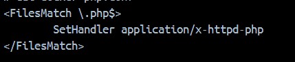

# File Upload

## What is a File Upload Vulnerability?

A file upload vulnerability allows an attacker to upload a malicious executable file to a server and then run that file. This is a critical security flaw, as it can potentially lead to Remote Code Execution (RCE).

---

## Where Does the File Upload Vulnerability Occur?

File upload features are common in modern web applications. These functionalities allow users to upload files from their local machines to the server, where they are stored and potentially processed. The vulnerability typically arises in file upload forms. In some cases, the file may not be uploaded directly but retrieved from a URL provided by the user—still leading to the same type of issue.

---

## When Does This Vulnerability Occur?

For a file upload vulnerability to be exploitable, two main conditions must be met: the file must be **stored** and then **executed**.

### 1. Stored

This condition occurs when the server either lacks proper input validation or has weak filtering mechanisms, allowing an attacker to upload and store a malicious file on the server.

### 2. Executed

Execution refers to the act of running the uploaded malicious file. Simply uploading a file with harmful payloads does not pose an immediate threat unless the file is actually executed. However, if the attacker finds a way to trigger the execution, the vulnerability becomes critical—and in the worst-case scenario, it can result in RCE.

---

## Why Does This Vulnerability Arise?

As mentioned, this vulnerability depends on two key factors: storage and execution. Let’s examine why each might occur:

### Storage Issues

A malicious file can be successfully stored on the server due to various reasons, such as:

- **No file type validation**: The server accepts all file types without restriction.
- **Incomplete or weak validation mechanisms**: Typically, two methods are used—blacklisting and whitelisting:
    - **Blacklisting**: It’s difficult to cover all dangerous file types and variations. Example: ‘.php’, ‘.asp’, ‘.phtml’, … we can’t cover all type file.
    - **Whitelisting**: Only allows a specific set of file types, which may be too restrictive in some contexts.
- **Improper implementation of filters**: Relying on file MIME types or client-side indicators is insecure, as these can be easily spoofed. The safer approach is to validate based on both file extensions and actual file signatures (magic bytes).

### Execution Pathways

Execution is the most critical aspect, as malware is only dangerous when it runs. If a malicious file is merely stored and never used, it poses no real threat. However, execution can occur for several reasons:

- The web application allows users to directly access and execute their uploaded files.
- The backend might process or run the file as part of a workflow.
- Even if the filename is changed and stored in a secret location, an attacker might still discover the path and access it.

Other scenarios may also exist, but the ability to execute the uploaded file is what turns this from a minor issue into a severe vulnerability.

---

## What is the basic knowledge about it?

The first we need some basic knowledge include:

- HTTPd
- PHP interpreter
- File extension
- Mod PHP
- File signature

### 1. HTTPd

**HTTPd** (HTTP Daemon) is the core component of the Apache web server, responsible for receiving and processing HTTP requests from clients.

### **Detailed Operation Mechanism:**

1. **Request Analysis:**
    - When receiving a request, HTTPd checks:
        - The requested file path
        - The file extension
        - HTTP headers
2. **File Processing:**
    - **Static Files (.html, .css, .js, .jpg):**
        - HTTPd reads the file from the filesystem
        - Returns it directly to the client
        - May apply additional modules (e.g., **`mod_deflate`** for compression)
    - **Dynamic Files (.php, .py, .pl):**
        - HTTPd forwards the request to the appropriate handler:
            - **PHP:** Uses **`mod_php`** or **PHP-FPM**
        - The handler executes the script
        - Returns the result to HTTPd
        - HTTPd sends the response to the client
3. **Handler Determination Mechanism:**
    - Based on configuration in:
        - **`AddHandler`** / **`SetHandler`** directives
        - **`.htaccess`** files
        - **`<FilesMatch>`** or **`<Location>`** blocks

### **Configuration File Locations:**

- **Ubuntu/Debian:**
    - **`/etc/apache2/apache2.conf`** (main config)
    - **`/etc/apache2/mods-available/`** (modules)
    - **`/etc/apache2/sites-available/`** (virtual hosts)
- **CentOS/RHEL:**
    - **`/etc/httpd/conf/httpd.conf`**
    - **`/etc/httpd/conf.d/`**
    - **`/etc/httpd/conf.modules.d/`**



---

### 2. Mod PHP

**Mod PHP** is an Apache module integrated to interact with the **PHP interpreter**. It allows the Apache server to process files with the `.php` extension and send the response back to the user.

- **How `mod_php` works:**
    - When Apache receives a request for a **`.php`** file:
        1. **`mod_php`** forwards the request to the **PHP interpreter** (embedded within the Apache process).
        2. PHP executes the code and returns the output to **`mod_php`**.
        3. **`mod_php`** communicates with HTTPd to send the final response back to the client.

---

### 3. PHP Interpreter

We won't go too deep into the inner workings of the PHP interpreter. Simply put, the PHP interpreter is responsible for **processing the PHP code** we write and returning the result.

---

### 4. File Extension

This refers to the part that describes the file type. HTTPd relies on the file extension to determine how to handle the file. A file extension is typically attached to the file name in the format: `[filename].[file extension]` (e.g., `index.php`).

---

### File Signature

A **file signature** is a sequence of bytes located at the beginning of a file, used to determine the file’s **actual format** by analyzing its binary content rather than relying solely on the file extension (such as `.jpg`, `.php`, `.pdf`, etc.).

This technique is commonly used to detect files with **forged extensions**. You can explore a comprehensive list of file signatures here: [`https://en.wikipedia.org/wiki/List_of_file_signatures`](https://en.wikipedia.org/wiki/List_of_file_signatures)

---

After understanding the necessary components, we will now move on to the process of **uploading a file to the web server** and **how to access it**.

### Progress Upload file to server


### Access File in web server


1. The **client** sends a request for the file `vul.php` located in the `uploads` folder, with the absolute path: `/var/www/html/uploads/vul.php`.
2. The **server** receives the request and instructs **HTTPd** to retrieve the specified file.
3. **HTTPd** detects that the file has a `.php` extension. Based on the configured handler, it forwards the request to **`mod_php`** for processing.
4. **`mod_php`** interacts with the **PHP interpreter** to execute the contents of `vul.php` and obtain the output.
5. **HTTPd** takes the processed output and sends it back to the **client** as the HTTP response.\

After understanding this detailed process, we now move on to how the **backend handles file extension checks**.

---

# How to exploit this type vulnerability

In web applications, file upload features are typically controlled using two main mechanisms: **blacklists** and **whitelists**, to restrict the types of files users can upload. However, both approaches have their **own weaknesses**, especially when not combined with additional security measures.

Moreover, the **methods used to identify the file type** may vary depending on the specific implementation and framework. This leads to potential vulnerabilities if the checks are insufficient or improperly handled.

When processing file uploads, web applications usually rely on **three key elements** to determine the type of the uploaded file:

- **File extension** (from the filename).
- **Content-Type (MIME type)** in the HTTP request.
- **File signature** (also known as magic number) — checking the initial bytes of the file.

Each of these methods can be implemented in different ways. In this document, I will present a few common code patterns referenced from **PortSwigger** and **CyberJutsu.io (CBJS)**, along with **techniques I used to exploit their weaknesses**.

---

### Checking Based on the File Extension from the `filename` Field

**Idea:**

The application extracts the filename provided by the user (usually from the `filename` field in the upload form) and retrieves the extension to determine the file type. This extension is then checked against a **whitelist** (allowed types) or a **blacklist** (blocked types).

This is a common method but is **easily bypassed** if not implemented carefully, due to the following reasons:

**Code:**

```php
if (isset($_FILES["file"])) {
    $error = '';
    $success = '';
    try {
        $filename = $_FILES["file"]["name"];
        $extension = end(explode(".", $filename));
        if (in_array($extension, ["php", "py", "jsp"])) {
            die("Hack detected");
        }
        $file = $dir . "/" . $filename;
        move_uploaded_file($_FILES["file"]["tmp_name"], $file);
        $success = 'uploaded file: <a href="/' . $file . '">/' . $file . ' </a><br>';
        $success .= 'View all: <a href="/' . $dir . '/">/' . $dir . ' </a>';
    } catch (Exception $e) {
        $error = $e->getMessage();
    }
}
```

### **Weakness:**

In **PHP**, with default configuration, the web server does not only execute files with a `.php` extension. It also supports other executable extensions such as:

- `.phtml`
- `.php3`
- `.php4`
- `.php5`
- `.phar`

This means that even if `.php` files are blacklisted, an attacker can still upload and execute malicious code using one of the **less common extensions**, unless those are also properly filtered.

Exploit:

Idea: upload 1 file vul.phtml contain content : `<?php phpinfo(); ?>`. After monitor response. If file upload successful then we will access to file uploaded and if response is info PHP then we successful 

Step by step:

1. we will post 1 file vul.phtml with content: `<?php phpinfo(); ?>` to server.
    
    
    
2. After we will access to file uploaded and see file execute success.
    
    
    
3. After we can upload 1 file malicious to server.
    
    
    
4. Next to we will access to it
    
    
    

### Checking Based on `Content-Type` from HTTP Request

### **Idea:**

The application validates the `Content-Type` field from the file upload request (specifically `$_FILES["file"]["type"]` in PHP). If the MIME type matches a predefined **whitelist** (e.g., `image/jpeg`, `image/png`, etc.), the file is accepted. Otherwise, the upload is blocked.

Code:

```php
if (isset($_FILES["file"])) {
    $error = '';
    $success = '';
    try {
        $mime_type = $_FILES["file"]["type"];
        var_dump($mime_type);
        if (!in_array($mime_type, ["image/jpeg", "image/png", "image/gif"])) {
            die("Hack detected");
        }
        $file = $dir . "/" . $_FILES["file"]["name"];
        move_uploaded_file($_FILES["file"]["tmp_name"], $file);
        $success = 'Successfully at: <a href="/' . $file . '">/' . $file . ' </a><br>';
        $success .= 'View all at: <a href="/' . $dir . '/">/' . $dir . ' </a>';
    } catch (Exception $e) {
        $error = $e->getMessage();
    }
}
```

### **Weakness:**

- The `Content-Type` header can be **manipulated by the user**. While browsers send it automatically, attackers can modify it using tools like Burp Suite or curl.
- Relying solely on `Content-Type` without verifying the **actual file contents (file signature)** is extremely dangerous.
- An attacker could upload a **malicious PHP file** while setting `Content-Type: image/png`, bypassing the check.

### **Exploit:**

**Idea:**

1. Create a malicious file named `vuln.php` containing:
    
    ```php
    <?php phpinfo(); ?>
    ```
    
2. Use a tool (e.g., **Burp Suite**, **curl**) to modify the `Content-Type` header in the request to a valid type (e.g., `image/png`).
3. Submit the upload request and monitor the response. If the upload succeeds, access the file on the server.
4. If the PHP info page is displayed, **the code has been successfully executed**.

**Exploit:**

1. Upload file with content `<?php phpinfo(); ?>` and changed content type correct with condition.
    
    
    
2. After assurance file upload success and access if response information of PHP then we exploit successful
    
    
    
3. Next to upload malicious to server
    
    
    
4. After see response then we sure is file upload success then we access to malicious and execute malicious.
    
    
    

### Checking Based on File Signature (Magic Bytes)

### **Idea:**

Instead of relying on file extension or browser-provided `Content-Type`, the application inspects the **actual contents of the uploaded file**, specifically the **initial bytes**, known as **file signature** or **magic numbers**, to determine its true type.

This method is more reliable, but if used in isolation — **without verifying the file extension** — it can still be bypassed.

Code:

```php
$finfo = finfo_open(FILEINFO_MIME_TYPE);
$mime_type = finfo_file($finfo, $_FILES['file']['tmp_name']);
$whitelist = array("image/jpeg", "image/png", "image/gif");
if (!in_array($mime_type, $whitelist, TRUE)) {
    die("Hack detected");
}
$file = $dir . "/" . $_FILES["file"]["name"];
move_uploaded_file($_FILES["file"]["tmp_name"], $file);
$success = 'Successfull at: <a href="/' . $file . '">/' . $file . ' </a><br>';
$success .= 'View all at: <a href="/' . $dir . '/">/' . $dir . ' </a>';
```

### **Weaknesses:**

- While file signature checking is powerful and helps detect forged files:
    - It **does not verify the file extension** — files like `.php`, `.phtml` may still be uploaded.
    - **File signatures can be faked** — e.g., a PHP file can start with the `GIF89a` magic bytes while still containing executable PHP code.
    - **Desync between extension and signature** — A file with `.php` extension and `image/gif` signature may bypass the validation, but still be executed as PHP by the server.

Exploit:

Idea:

1. Ta sẽ upload 1 file vul.php và tạo 1 file signature giả nhằm bypass xác thực. sau đó content của file là `<?php phpinfo(); ?>`
2. Add a fake file signature at the beginning (e.g., `GIF89a`) to match a valid image type.
3. Upload the file using the vulnerable form. If successful, visit the uploaded file’s URL.
4. If the PHP code executes, the protection was bypassed.
5. Proceed to upload a **web shell** or remote code execution payload and interact with it.

Exploit process:

1. Upload file vul.php và fake file signature
    
    
    
2. Access to file uploaded
    
    
    
3. Sure file upload and execute successful. After upload malicious to server
    
    
    
4. After we access and exploit it with cmd command.
    
    
    

---

## **How to prevent File Upload Vulnerabilities**

### 1. **Validate File Extension**

- Use a **whitelist** of allowed extensions (e.g., `.jpg`, `.png`, `.pdf`).
- Avoid blacklist; attackers can use obscure PHP extensions like `.phtml`, `.php5`.
- Rename uploaded files (e.g., with UUID) to remove risky extensions.

---

### 2.  **Validate MIME Type and File Signature**

- Use functions like `finfo_file()` to validate the real file type.
- Never trust `$_FILES["file"]["type"]` or browser-supplied headers.
- Match actual MIME types against a secure whitelist.

---

### 3. **Inspect File Content**

- For images: use libraries like `getimagesize()` to ensure the file is a real image.
- For documents: validate headers or use antivirus scanners.

---

### 4. **Rename and Store Files Safely**

- Do not store user-uploaded files with original filenames.
- Use unique names (UUIDs or hashes).
- Prevent execution of uploaded files by server:
    - Apache: via `.htaccess`
    - Nginx: via `location` blocks

---

### 5. **Proper Web Server Configuration**

- Disable script execution in upload directories:
    - Apache:
        
        ```php
        <Directory "/var/www/html/uploads">
            php_admin_flag engine off
        </Directory>
        
        ```
        
    - Nginx:
        
        ```php
        location /uploads/ {
            disable_symlinks if_not_owner from=$document_root;
            location ~ \.php$ {
                return 403;
            }
        }
        
        ```
        

### **6. Limit File System Access**

- Restrict `write` and `execute` permissions for web server users.
- Use AppArmor/SELinux to sandbox file access.