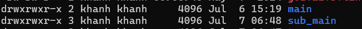

# Symbolic link

# Concept of symbolic link

In Linux, a **symbolic link** is like a **shortcut** that allows you to quickly access another file or directory. It works similarly to a **pointer in the C/C++ programming language**.

For example:

Suppose we have a variable `A` that holds the memory address `1000`, and a pointer `B` that points to `A`. In that case, `B` is essentially pointing to memory address `1000`.

```php
A → [1000]  
B → A → [1000]
```

This means that if you change the data through `B`, you're actually modifying the memory at address `1000`, which is where `A` points to.

Similarly, in Linux:

Let’s say there’s a file `a.txt` located at `/var/www/html/a.txt`, and you create a symbolic link called `b.txt` at `/home/kali/b.txt`. Then:

```php
b.txt → a.txt
```

Any read, write, or edit operation you perform on `b.txt` actually affects `a.txt` directly. That’s because `b.txt` is just a link pointing to `a.txt`, not an independent copy of the file.
Now, we have some images about symbolic link in linux.



we have 2 directory is main and sub_main.


There is a file named `content.txt` in the `main` directory, and in the `sub_main` directory, there's a symbolic link called `symbolic_link.txt` that points to it.


Accessing `symbolic_link.txt` displays the same data as `content.txt` because it is a symbolic link. Any changes made through the symbolic link will directly affect `content.txt`.

# Symbolic link in hacking

## Upload symbolic link to server


When we direct upload file have symbolic link to server then file don’t have symbolic link in server. It just normal file. 

If we upload 1 file have symbolic link to server we need zip it. but don’t all case zip is file have symbolic link. we must correct zip. In Linux have support for we zip symlink. this is tool [zip] with **`option -y`**.


this option allow we can store symbolic link as in the zip archive. Now we have example zip symbolic link using **`Option -y`** and don’t use it:

- **`Option -y`**:
    - zip file link to passwd.txt is symbolic link to file passwd.
    
    
    
    after we copy zip file to folder home and unzip it. we can see. This file symbolic link to **`/etc/passwd`**
    
    
    
- Zip file but don’t use to **`option -y`**:
    - we zip file link to passwd.txt and copy it to folder home. after unzip it. then this file is not symbolic link. it just normal file.
        
        
        
        
        

After creater a file zip have symbolic link then we will upload in server. 


 In we have example about web site allow upload file and unzip it. Now, we see result of it

1. We have src code web site allow unzip file and store it to **`/var/www/html/[$dir]/`**


1. we will upload file zip have symbolic link to server.


1. Seen debug info we determine file **`link_to_password.txt`** → **`/etc/passwd.`**


1.  Now we will read file it. Wow, we read file **`/etc/passwd`** in server.


## Symbolic link to read file

This is vulnerability allow we read sensitive file in server by use to feature symbolic link. How to exploit it same with my example:


## Symbolic link to RCE

Symbolic link it not just apply with file, it can apply with folder. Example:

1. We create a symlink to root


1. check file symlink


1. cd to symlink and we access to root folder.


But just upload folder then how to RCE server. In linux have a interesting feature is when we upload 1 folder symlink but it empty then when we upload new folder have same name with folder symlink and new folder have file code RCE then file code RCE server will compress two folder to one folder and file code RCE will in location of symlink 


---

# How to prevent it

we have two method prevent type vulnerability symbolic link include:

- Detect file have symbolic link. Don’t allow upload it by code backend
    - Example:
        - Using code backend
            
            ```php
            $cmd = "[ -L \"$file\" ] && echo \"Don't allow file symbolic link\"";
            $output = shell_exec($cmd);
            if (!empty($output)) {
                die('Hack detect;);
            }
            ```
            
- Detect symbolic link by config server:
    - Example: Using config in server:
        - Apache:
            - Use config detect symlink
            
            ```php
            Options -FollowSymLinks
            ```
            
        - nginx then we can use SELinux OR AppArmor:
            
            ```php
            deny /home/** mrwkl,   # Detect all symlink access to /home
            ```
